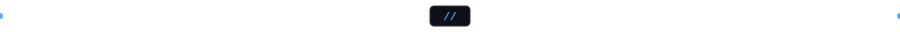
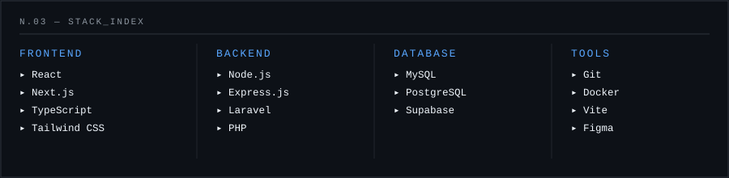
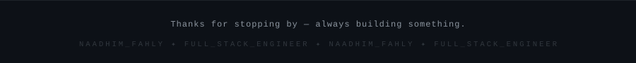

</div>

<br />

### `ABOUT`

I'm **Naadhim Fahly Mubaarok**, a freelance Full Stack Engineer and Software & Network Engineering student at SMK Telkom Sidoarjo. Since starting my web development journey in 2024, I've built company profiles, business sites, and web applications for clients and personal projects — working across the stack from React/Next.js interfaces to Laravel and Node.js backends.

I care about clean architecture as much as clean UI, and I'm currently deepening my grasp of network systems alongside full-stack engineering.

<br />



<br />

### `CURRENTLY`

```text
▸ Building   STUDIO_VOID — a kinetic brutalist portfolio in Next.js 16 + TypeScript
▸ Learning   Advanced network engineering concepts (SIJA coursework)
▸ Exploring  Interactive front-end motion with Framer Motion
▸ Improving  Backend architecture patterns for client projects
```

<br />


<br />

### `STACK`



<br />
<br />

### `FEATURED PROJECTS`

<table>
<tr>
<td width="50%" valign="top">

**Naadhim Fahly — Portfolio**
Kinetic brutalist personal portfolio with cursor-driven motion and an editorial capabilities index.

`Next.js 16` `TypeScript` `Tailwind CSS` `Framer Motion`

[Live Site ↗](https://naadhim-fahly.vercel.app/)

</td>
<td width="50%" valign="top">

**Niscahya Indonesia Cerdas**
Client project — company site & admin panel for a solar-lighting (PJU) distributor, with a product catalog and blog CMS.

`React` `Vite` `Express.js` `MySQL` `Tailwind CSS`

[Live Site ↗](https://cvniscahya.com) · [Repository ↗](https://github.com/Nademmm/Niscahya-Indonesia-Cerdas)

</td>
</tr>
<tr>
<td width="50%" valign="top">

**MyPocket**
Fintech-inspired personal finance tracker with budgeting, savings targets, and a gamified achievements system.

`Laravel 11` `Blade` `MySQL` `Tailwind CSS` `Chart.js`

[Repository ↗](https://github.com/Nademmm/MyPocket)

</td>
<td width="50%" valign="top">

**[YOUR PROJECT NAME]**
[Short one-line description of the project.]

`[TECH]` `[TECH]` `[TECH]`

[Repository ↗](#) · [Live Demo ↗](#)

</td>
</tr>
</table>

<br />


<br />

### `ACTIVITY`

<div align="center">


</div>

<br />

### `CONNECT`

<div align="center">
<a href="https://github.com/Nademmm"></a>
<a href="https://linkedin.com/in/naadhimfahly"></a>
<a href="https://naadhim-fahly.vercel.app/"></a>
<a href="mailto:nademmm27@gmail.com"></a>
</div>

<br />

<div align="center">

</div>